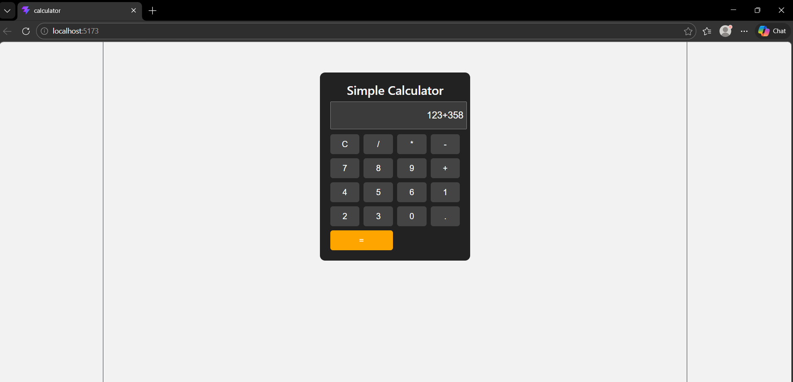

# Ex04 Simple Calculator - React Project
## AIM
To  develop a Simple Calculator using React.js with clean and responsive design, ensuring a smooth user experience across different screen sizes.

## ALGORITHM
### STEP 1
Create a React App.

### STEP 2
Open a terminal and run:
  <ul><li>npx create-react-app simple-calculator</li>
  <li>cd simple-calculator</li>
  <li>npm start</li></ul>

### STEP 3
Inside the src/ folder, create a new file Calculator.js and define the basic structure.

### STEP 4
Plan the UI: Display screen, number buttons (0-9), operators (+, -, *, /), clear (C), and equal (=).

### STEP 5
Create a new file Calculator.css in src/ and add the styling.

### STEP 6
Open src/App.js and modify it.

### STEP 7
Start the development server.
  npm start

### STEP 8
Open http://localhost:3000/ in the browser.

### STEP 9
Test the calculator by entering numbers and operations.

### STEP 10
Fix styling issues and refine content placement.

### STEP 11
Deploy the website.

### STEP 12
Upload to GitHub Pages for free hosting.

## PROGRAM
# app.js 
```
import React, { useState } from "react";
import "./App.css";

export default function App() {
  const [input, setInput] = useState("");

  const handleClick = (value) => {
    setInput(input + value);
  };

  const clearInput = () => {
    setInput("");
  };

  const calculateResult = () => {
    try {
      setInput(eval(input).toString());
    } catch {
      setInput("Error");
    }
  };

  return (
    <div className="calculator">
      <h2>Simple Calculator</h2>

      <input type="text" value={input} readOnly className="display" />

      <div className="buttons">
        <button onClick={clearInput}>C</button>
        <button onClick={() => handleClick("/")}>/</button>
        <button onClick={() => handleClick("*")}>*</button>
        <button onClick={() => handleClick("-")}>-</button>

        <button onClick={() => handleClick("7")}>7</button>
        <button onClick={() => handleClick("8")}>8</button>
        <button onClick={() => handleClick("9")}>9</button>
        <button onClick={() => handleClick("+")}>+</button>

        <button onClick={() => handleClick("4")}>4</button>
        <button onClick={() => handleClick("5")}>5</button>
        <button onClick={() => handleClick("6")}>6</button>

        <button onClick={() => handleClick("1")}>1</button>
        <button onClick={() => handleClick("2")}>2</button>
        <button onClick={() => handleClick("3")}>3</button>

        <button onClick={() => handleClick("0")}>0</button>
        <button onClick={() => handleClick(".")}>.</button>

        <button className="equal" onClick={calculateResult}>
          =
        </button>
      </div>
    </div>
  );
}
```
# app.css
```
body {
  font-family: Arial, sans-serif;
  background: #f2f2f2;
}

.calculator {
  width: 250px;
  margin: 60px auto;
  padding: 20px;
  background: #222;
  border-radius: 10px;
  text-align: center;
  color: white;
}

.display {
  width: 100%;
  height: 40px;
  margin-bottom: 10px;
  font-size: 18px;
  text-align: right;
  padding: 5px;
}

.buttons {
  display: grid;
  grid-template-columns: repeat(4, 1fr);
  gap: 8px;
}

button {
  padding: 10px;
  font-size: 16px;
  border: none;
  background: #444;
  color: white;
  cursor: pointer;
  border-radius: 5px;
}

button:hover {
  background: #666;
}

.equal {
  grid-column: span 2;
  background: orange;
}
```

## OUTPUT


## RESULT
The program for developing a simple calculator in React.js is executed successfully.
